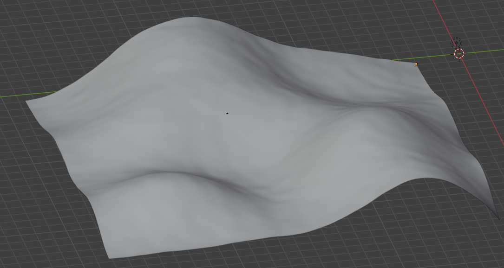
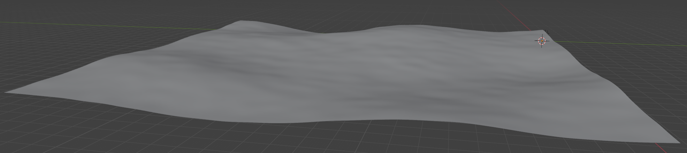
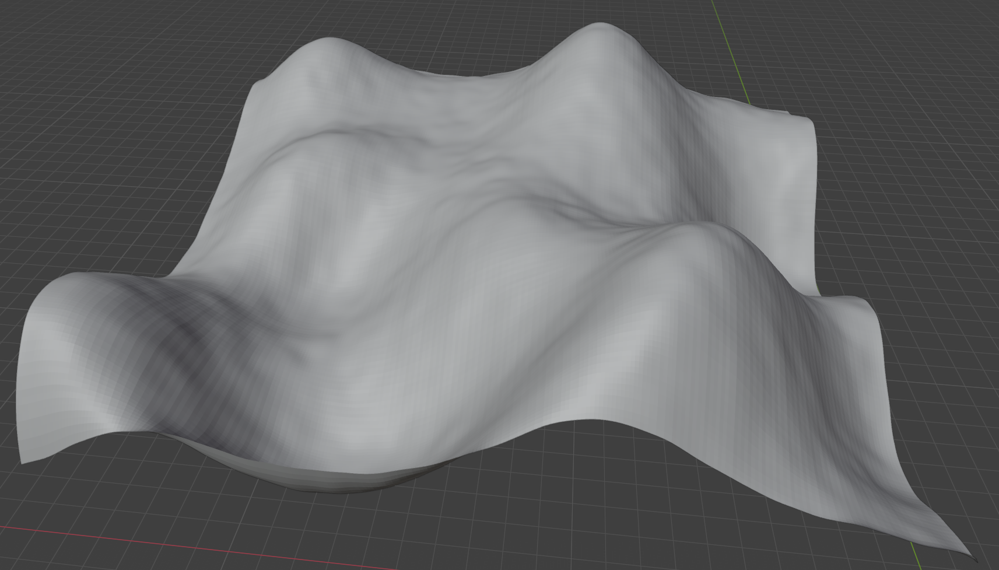

# Ruby WorldGen

## Overview

This project is an exploration library intended to support generating terrain models using a variety of generators and transform functions. The ultimate goal is for it to be served via a Web interface where users can leverage a visual scripter to quickly design terrain, much like the tool World Engine. This implementation will focus (initially at least) on the output of obj files and is not concerned about generation of textures or materials, just the models themselves.

It currently supports perlin noise-esque generation of points and allows users to control aspects like the strength of the noise, the amount of smoothing applied, etc. It allows users to apply grids on-top of one another with control of the strength of the application (1 overrides, .5 applies an even mix, etc.). It supports flooring the terrain and allows users to leverage seeds for consistent generation.

Future deleveopment will support additional generators (specifically simplex and diamond-square) as well as concepts like clamping/masking and erosion.

Examples of terrain generated with the tool:

